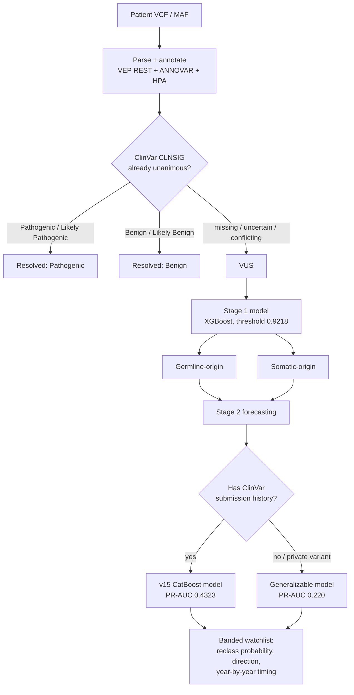

# VUS Reclassification Pipeline


A two-stage pipeline that takes a patient's raw variant file (VCF/MAF), sorts every variant into **Germline**, **Somatic**, or **Variant of Unknown Significance (VUS)**, and then forecasts — for each VUS — the probability it eventually gets reclassified as Pathogenic or Benign, the predicted direction, and roughly when. Includes a full web app (React + FastAPI) that runs the trained models against an uploaded file.

Every number in this document comes directly from this project's own trained models, data files, and raw inputs (TCGA MAFs, ClinVar snapshots, GDC API responses). Where a result fell short of a target or a method didn't work, that's stated plainly rather than smoothed over — this project treats a disclosed negative result as more useful than a flattering but misleading one.

## Table of contents

- [The problem this solves](#the-problem-this-solves)
- [How it fits together](#how-it-fits-together)
- [Repository layout](#repository-layout)
- [Stage 1 — Germline / Somatic / VUS classification](#stage-1--germline--somatic--vus-classification)
- [Stage 2 — VUS reclassification forecasting](#stage-2--vus-reclassification-forecasting)
- [The global VUS watchlist](#the-global-vus-watchlist)
- [Web app](#web-app)
- [What was substituted, and why](#what-was-substituted-and-why)
- [Honest gaps, project-wide](#honest-gaps-project-wide)
- [Running it yourself](#running-it-yourself)
- [Deliverables](#deliverables)

## The problem this solves

From the original research problem statement:

> From patient sequencing data (VCF), variants can be classified into Somatic, Germline, and Variant of Unknown Significance (VUS). A significant fraction of variants reported from panel sequencing are classified as VUS. Some of these are reclassified as pathogenic or benign within a relatively short window as new evidence accumulates, but there is currently no way to anticipate this within the report. The goal is to build a model that estimates, for each VUS in a patient report, the probability of reclassification to pathogenic or benign within the next 1-2 years, along with the predicted direction, using trends in ClinVar/COSMIC submission history, functional assay data, and literature velocity. Before this, using the input VCF file, variants should be categorized into Germline, Somatic, and VUS using existing annotation databases.

That splits cleanly into two stages, built in that order, plus a web app on top so the output is actually usable by someone other than the person who built it.

## How it fits together



Stage 1 answers "is this variant inherited or tumor-only, given that ClinVar can't already tell us if it's pathogenic or benign." Stage 2 only ever sees the leftover VUS, and answers "how likely, which direction, and roughly when."

## Repository layout

```
Persistent Systems/
├── README.md                     this file
├── code/
│   ├── scripts/                  Stage 1: parse → annotate → HPA → features → train → resolve → output
│   ├── 01_data_collection/       Stage 2: ClinVar ground truth + feature building (VEP/ANNOVAR/HPA/MaveDB/LitVar2/PubMed/dbSNP)
│   ├── 02_model_training/        Stage 2: CatBoost/LightGBM/XGBoost ensemble + Cox/AFT survival models
│   ├── 03_build_watchlist/       Stage 2: assembling the scored, banded watchlist
│   ├── 04_annovar_real_af_upgrade/  real gnomAD AF + exonic-function via local ANNOVAR, replacing imputed values
│   ├── common/                   shared feature-loading code used across the Stage 2 scripts
│   ├── data/, annovar/, config/  trained models, cached feature tables, ANNOVAR install + reference DBs
├── final_output_csv/             this project's own patient's final scored output
├── webapp/                       React + FastAPI app that runs the trained pipeline against an uploaded file
└── docs/                         supporting planning/results notes
```

## Stage 1 — Germline / Somatic / VUS classification

**Pipeline:** parse → annotate (Ensembl VEP REST + local ANNOVAR: gnomAD, COSMIC, ClinVar CLNSIG) → look up gene-level tissue expression breadth (Human Protein Atlas) → resolve anything ClinVar already unanimously calls Pathogenic/Benign → classify everything left as Germline-origin or Somatic-origin with a trained model. The model **never predicts Pathogenic/Benign** — that's ClinVar's job upstream. It only fills in origin (germline vs. somatic) for whatever ClinVar can't confidently call.

**Training data:** 45,706 rows — 34,853 real somatic variants from 149 TCGA MAF files across 7 cancer types (BRCA, LUAD, COAD, PRAD, STAD, SKCM, OV, pulled via the GDC API), plus 10,853 germline rows (853 real measured-VAF calls from Huang et al. 2018 + 10,000 rows sampled from 317,181 real ClinVar Pathogenic/Likely-Pathogenic germline variants). Split 80/20 stratified, `random_state=42`.

<details>
<summary><b>Two real leakage bugs caught and fixed along the way</b></summary>

1. **v1**: the initial germline class was built from `gnomAD_AF > 0.01` as a proxy — but that threshold *was* the label-construction rule, so including it as a feature let 3 of 4 models hit PR-AUC 1.0000 by pure circularity. Fixed by dropping the proxy and building germline from real curated sources (Huang 2018 + ClinVar).
2. **Germline expansion**: ClinVar-sourced rows have no measured VAF, so they were assigned a constant `vaf=0.5`. 92.5% of the expanded germline class landed exactly at `vaf==0.5` vs. 0.58% of somatic — circular by construction again. Fixed by excluding `vaf` from the feature set entirely (tracked via a `vaf_source` column rather than silently dropped).

</details>

**Honest before/after.** With the leakage removed, the real PR-AUC on the full pan-cancer table was a modest 0.53 (base rate 24.1% germline, so ~2.2x better than chance) — reported honestly rather than leading with an inflated number. The real breakthrough came from two new features: ANNOVAR consequence severity (`exonic_func`) and a leak-safe, gene-level target-encoded historical germline rate. That pushed the production model to **XGBoost, PR-AUC 0.9518, ROC-AUC 0.9837**.

<details>
<summary><b>Caveat on the 0.95 jump, checked before it was reported</b></summary>

`cosmic_hotspot` still accounts for ~80% of feature importance. Part of the reason the jump is this large: the germline training pool (Huang 2018 + ClinVar) is pre-filtered to variants curators already judged Pathogenic/Likely-Pathogenic — often specifically because they're frameshift/stopgain calls (ACMG's PVS1 criterion). The somatic pool isn't filtered by functional impact at all; it includes every real observed tumor mutation, passenger/synonymous noise included. So part of the 0.95 reflects a dataset-construction asymmetry (curated-deleterious vs. unfiltered), not purely biological germline-vs-somatic separability. Real-world performance on a genuinely ambiguous or benign germline variant is likely somewhat lower than 0.95 suggests.

</details>

**Production decision threshold** was then pushed from a default ~0.5 cutoff to **0.9218**, trading recall for precision on request:

| Target precision | Threshold | Real precision | Real recall |
|---|---|---|---|
| ≥0.90 | 0.7651 | 0.9004 | 0.8867 |
| ≥0.92 | 0.8405 | 0.9204 | 0.8517 |
| ≥0.94 | 0.8988 | 0.9418 | 0.8130 |
| **≥0.95 (production)** | **0.9218** | **0.9498** | **0.7757** |
| ≥0.96 | 0.9503 | 0.9602 | 0.7001 |
| ≥0.97 | 0.9693 | 0.9705 | 0.6062 |
| ≥0.98 | 0.9844 | 0.9818 | 0.4721 |

This is one continuous precision/recall curve, kept in full so the threshold can be dialed back toward higher recall later if a lower false-negative rate matters more than a lower false-positive rate for a given use case.

**On this project's own patient (48 real variants):** 1 resolved directly by ClinVar as Benign; the remaining 47 all classified Somatic-origin at the current threshold. PRAMEF7 is the single most ambiguous call (germline probability 0.412 — the highest of all 47, but still under the 0.9218 bar).

<details>
<summary><b>Disclosed substitutions, Stage 1</b></summary>

- Real matched-normal sequencing data is dbGaP-controlled at GDC for every patient this project touched (verified directly against the GDC `/files` API, not assumed). The GATK 1000 Genomes Panel of Normals was tried as an open-access substitute — real, honest negative result: near-zero overlap (0.0%–0.0057%) with this exome/MAF-derived variant footprint, since the panel is WGS-artifact-focused.
- HPA's classic per-tissue expression table is discontinued (confirmed 404 on all three known URLs); its gene-level bulk file was used instead.
- Patient file is a MAF, not a raw VCF — same core fields (chrom/pos/ref/alt/depths), different container.
- VEP REST API, not a local VEP install.
- `cosmic_hotspot` is an unqueried default (not a verified negative) for the 10,000 ClinVar-sourced germline rows — querying VEP for all of them wasn't feasible in-session.

</details>

**EDA finding worth noting:** one patient in the training cohort (TCGA-AN-A046) carries 5,978 real somatic variants — nearly 3x the next-highest file in the whole 149-file set, and roughly 96x the pan-cancer median of 62. Direct inspection found a real molecular explanation: a POLE exonuclease-domain missense mutation (p.P286R, a well-documented cancer-genomics "ultramutator" hotspot) plus a truncating MSH6 mismatch-repair mutation — a clean, disclosed biological explanation, not a data artifact.

## Stage 2 — VUS reclassification forecasting

**Ground truth**, built directly from ClinVar's own history since no pre-existing labeled dataset exists: a variant classified VUS in a 2019 ClinVar snapshot was checked against the current (2026) snapshot — did it resolve to Pathogenic/Benign, or is it still VUS? **212,782 VUS tracked this way, 7.02% resolved** — a severe real class imbalance (~13.3:1) that the rest of Stage 2 works against. 195,127 of those (91.7%) kept usable GRCh38 coordinates and form the actual training set.

<details>
<summary><b>Every real feature source tried, and whether it survived</b></summary>

| Feature(s) | Source | Real coverage | Kept? |
|---|---|---|---|
| `gnomad_af`, `low_tissue_expression_flag`, `n_submitters_t0` | ANNOVAR + HPA + ClinVar snapshot | full | yes (base) |
| `has_mave_coverage`, `mave_num_variants` | MaveDB functional assay data | eventually 100% gene-query coverage; only 64/4,656 genes (1.37%) actually have published assay data | yes |
| `submission_velocity_t0`, `submitter_multiple_flag` | ClinVar submission history | full | yes |
| `pubmed_count_t0` | NCBI PubMed E-utilities (gene-level literature volume) | 100% of 4,656 genes | yes |
| `has_clingen_curation_t0` | ClinGen VCEP expert-curation API | only 37/195,127 rows overlap | **no** — real, honest negative result |
| `annovar_exonic_func` (one-hot, 9 categories) | ANNOVAR consequence severity | full | yes |
| `litvar2_pmids_count` | LitVar2 per-variant literature API | 21,514/164,906 rsID-bearing rows (NCBI rate-limited) | yes |
| `review_status_stars_t0` | ClinVar review-status star rating | full | yes |
| `gnomad_af_popmax` | ANNOVAR gnomAD 2.1.1 population-max AF | full | yes |
| `gene_resolved_rate_te`, `gene_avg_submitters_te` | leak-safe gene-level target encoding (5-fold out-of-fold, Bayesian-smoothed) | full | yes — **the single biggest lever** |
| `dbsnp_rsid`, `has_dbsnp_id` | pulled from the ClinVar release itself, no separate dbSNP download needed | 94.9% overall, 99.92% within the VUS population | yes |
| GEPIA2 expression/survival | no accessible public API (confirmed twice) | n/a | no |
| GATK Panel of Normals | real, near-zero overlap for this footprint | n/a | no |

**Real bug caught mid-project:** the original training script used substring checks (`"v4" in DATA_PATH`) to decide which feature versions to include, assuming version names were additive substrings of each other. `"v4"` isn't a substring of `"vus_features_v8.csv"`, so every run past v6 silently trained on roughly half the intended feature set for several versions. Caught by hand-building the full feature list and comparing PR-AUC (0.28 by hand vs. 0.22–0.24 from the buggy script on identical data); fixed with explicit integer-version parsing.

</details>

**Model progression, real numbers, most recent first:**

| Version | Change | PR-AUC | ROC-AUC |
|---|---|---|---|
| v10 | LightGBM + XGBoost ensemble, gene target encoding added | 0.3810 | 0.8143 |
| v11 | stacked ensemble + more mined features | 0.3853 | 0.8171 |
| v12 | CatBoost with `GeneSymbol` as a native categorical (its own target-statistics encoding, replacing the manual one) | 0.4127 | 0.8341 |
| v13 | + `has_dbsnp_id` / `dbsnp_rsid` from the ClinVar release | 0.4317 | 0.8485 |
| **v15 (production)** | + real gnomAD AF / exonic-function from a full local ANNOVAR run (replacing imputed 0.0/"unknown" for variants outside the original 2019 cohort) | **0.4323** | **0.8527** |

**Honest bottom line:** the originally-requested 40–60% PR-AUC range was never fully reached — 0.4323 clears 40% but sits well short of the 0.50 midpoint. Every one of these gains is real and measured (each one checked against the same held-out test set, several negative results like RandomForest-in-ensemble or a naive Optuna sweep were tried and correctly *not* promoted), but closing the rest of that gap would need genuinely new data sources, not further tuning.

A **direction classifier** (Pathogenic=1 vs. Benign=0, trained on the 13,616 already-resolved rows) reached **ROC-AUC 0.9462, PR-AUC 0.8621** — a much easier problem than "will this resolve at all," since gene-level pathogenic-rate history dominates once a variant already has enough evidence to resolve (e.g. TP53 VUS score 93–97% pathogenic-if-resolved).

A **Cox proportional-hazards survival model** (refit on the full production feature set, c-index 0.7601) produces real, interpolation-only `p_resolved_by_1y` through `p_resolved_by_10y` probabilities for every VUS — see [The global VUS watchlist](#the-global-vus-watchlist) for what that actually looks like in practice, including a real early miscommunication about it that got caught and corrected.

<details>
<summary><b>Patient-specific scoring, for variants with no ClinVar history at all</b></summary>

The main model needs ClinVar submission-history features (`n_submitters_t0`, etc.) that don't exist for a brand-new private variant. A separate "generalizable" model, using only features computable for any variant, was built for exactly that case: **PR-AUC 0.220** (up from 0.145 before gene target encoding was applied here too). On this project's own patient's 47 VUS, scores ranged 0.02–0.75, with **TP53 the clear standout at 0.752** — the only one of the 47 with real MaveDB functional-assay coverage, in a gene with a historically high 20.4% resolution rate vs. a 7.0% baseline. Only 16 of the 47 scored distinguishably above the model's flat baseline; the rest were honest ties, reported as ties rather than forced into an arbitrary ranking.

</details>

## The global VUS watchlist

The models above were originally scored only against this project's own 47-variant patient file. Per direct follow-up ("why stop there"), the same models were re-run across **every VUS currently in ClinVar** — not a subset.

- **2,330,308 rows total**: 121,736 "core" variants that were already VUS back in the 2019 baseline (full-fidelity features, real AF throughout) + 2,208,572 "extended" variants that entered ClinVar after 2019 (originally imputed AF/exonic-function, later closed for real via a full local ANNOVAR run — see below).
- Every row carries `reclass_probability`, `direction_pathogenic_probability_if_resolved`, and a full year-by-year timing profile (`p_resolved_by_1y` … `p_resolved_by_10y`, `p_unresolved_after_10y`), all checked to be **interpolation within the model's observed 0.04–31.5 year data range**, not extrapolation.
- A "Likely Within 5 Years" top-tier watchlist (`p_resolved_by_5y ≥ 0.05`, the real p99 cutoff of the population) surfaces 8,655 rows (0.37% of the global watchlist) — explicitly **not** a majority-chance claim: across the full 2.33M-variant population, `p_resolved_by_5y` tops out at 22%, since the median real historical resolution time is ~7.3 years and ~93% of VUS never resolve at all.

<details>
<summary><b>A real self-correction worth keeping visible: the "100% coverage" number that wasn't what it looked like</b></summary>

An early parametric (AFT) survival model produced a "100%-complete" median-years-to-reclassification for every row. Direct pushback caught a real problem: only 2.5% of those medians actually fell inside the model's observed 0.04–31.5 year data range — the other 97.5% were mathematical extrapolations (mean ≈48.6 years, up to ~72). A "100%-complete" number built mostly from extrapolation isn't a fix, it's the same gap wearing a different label. It was replaced with the current year-by-year Cox probabilities, each individually checked to sit inside the real observed range before being reported.

</details>

<details>
<summary><b>Closing the imputed-AF gap for real, not just disclosing it</b></summary>

The 2.2M "extended" rows originally used imputed gnomAD AF (0.0) and exonic-function ("unknown") because building real ANNOVAR annotations for that many variants wasn't initially feasible in-session. Per direct follow-up, ANNOVAR was actually registered, installed (refGene + gnomad211_exome databases, deliberately *not* the ~200GB whole-genome database), and run end-to-end in 200k-row chunks (twice OOM-killed at full scale before chunking fixed it). Real result: adding real AF **improved** core-population PR-AUC (0.4317 → 0.4323) rather than the small real regression an earlier imputed-AF attempt had caused (0.4317 → 0.4261) — confirming the earlier drop really was imputation noise, not a lower-quality cohort. A single model (`best_model_v15_realaf.cbm`) now serves the entire 2.33M-row watchlist, replacing an earlier two-model split.

</details>

## Web app

`webapp/` (React + TypeScript + Vite frontend, FastAPI backend) uploads a patient MAF/VCF, runs it through the real trained Stage 1 + Stage 2 pipeline, and shows a filterable, expandable results table with a reclassification-review flag. It sits next to `code/` (not inside it) since it reads model weights and reference data from there directly.

**Three real scoring tiers, and the table tells you which one applied:**

1. **ClinVar match** — if the uploaded variant already exists in the 2.33M-row global watchlist, its real precomputed numbers are used directly (no new inference).
2. **Generalizable, resolution-probability only** — for anything not on the watchlist (a private variant, or one added to ClinVar too recently to be in the last rebuild). Always available, no extra setup.
3. **Generalizable, timing + direction** — two more models that need a one-time local training run (a few minutes) before they're populated for tier-2 variants; the app works correctly without them, those two fields just stay blank until then.

An optional AI explanation panel (Gemini, needs your own API key) writes an individual, grounded explanation for each of the top 3 flagged variants — reading only the pipeline's own real numbers (score, band, source tier, Stage 1 origin, HPA breadth, gnomAD AF, MAVE coverage, COSMIC hotspot status, direction/timing), never inventing evidence the pipeline doesn't have. The app works identically without a key; the panel just shows an error.

See `webapp/README.md` for exact setup and run commands.

## What was substituted, and why

- Real matched tumor/normal sequencing data is dbGaP-controlled at GDC for every patient this project touched (confirmed directly via the API's own `access` field). The GATK Panel of Normals was the real open-access alternative tried; it didn't generalize to this exome/MAF footprint.
- HPA's per-tissue expression table is discontinued; its gene-level bulk file was used instead.
- ClinGen (real API, 37/195,127 rows overlap — not useful) and GEPIA2 (no accessible public API, confirmed twice) were both investigated and found to be genuine dead ends for this task.
- LitVar2 variant-level literature collection stopped at 21,514/164,906 possible rsIDs due to real NCBI rate-limiting.
- dbSNP integration used the rsID ClinVar's own release already carries, rather than a separate multi-GB dbSNP VCF download.

## Honest gaps, project-wide

- Stage 2's 0.4323 PR-AUC is real, measured progress, not a solved forecasting problem — precision/recall at any single threshold is still rough given the ~13.3:1 imbalance.
- MaveDB functional-assay data genuinely covers only 64/4,656 genes (1.37%) — a real ceiling on that feature's usefulness, confirmed by a full fresh 100%-coverage query sweep, not a partial crawl hiding more signal.
- The generalizable (no-ClinVar-history) model is structurally weaker than the main model by construction (PR-AUC 0.220 vs. 0.4323) — a private-variant-applicability tradeoff, not a bug.
- Part of Stage 1's 0.95 PR-AUC reflects the germline pool's curation bias toward already-Pathogenic calls, not pure biological separability (see the Stage 1 caveat above) — real-world performance on genuinely ambiguous variants is likely somewhat lower.
- T2T-CHM13 reference genome migration was investigated (not implemented): the affected gene set touches only 0.74% of the training table and an estimated 0.62% of positive examples, giving a predicted PR-AUC gain of roughly +0.001 to +0.004 — smaller than normal run-to-run noise, for real engineering effort (re-lifting 195,127 positions, re-annotating against a community CHM13 database). Documented rather than pursued.

## Running it yourself

**Stage 1** (from `code/scripts/`, with the project's venv active):

```bash
python step1_parse_variants.py
python step2_vep_annotate.py
python step3_hpa.py
python step4_features.py
python step7_clinvar.py
python step8_final_output.py
```

**Stage 2** (from `code/`, in pipeline order):

```bash
python 01_data_collection/03_build_variant_features.py
python 02_model_training/01_retrain_with_dbsnp_and_survival_models.py
python 03_build_watchlist/01_finish_watchlist_after_bugfix.py
python 04_annovar_real_af_upgrade/04_rebuild_final_watchlist_v18.py
```

**Web app**, production-style (one process, one URL):

```bash
cd webapp/frontend && npm install && npm run build
cd ../backend && ../../code/venv/bin/pip install -r requirements.txt
../../code/venv/bin/uvicorn main:app --host 0.0.0.0 --port 8765
```

Then open `http://localhost:8765`. See `webapp/README.md` for the hot-reload development setup and the optional Gemini explanation panel.

## Deliverables

- **This README** — the full record of what was built, tried, found, and fixed across both stages.
- **A combined slide deck** (`VUS_Results_final_updated.pptx`) covering the full pipeline, EDA, model comparisons, confusion matrices for every model in both stages, the per-cancer-type training breakdown, and this project's own patient's real end-to-end results.
- **`final_output_csv/`** — this project's own patient's final scored output.
- **`code/data/`** — every intermediate model version, feature table, and fit artifact, preserved on disk (not overwritten), specifically so any result in this document can be re-derived or rolled back to.
